# react-modular-datepicker

A modular, lightweight, and type-safe React datepicker library. Whether you need a fully-featured calendar component or a headless hook to build your own UI, `react-modular-datepicker` has you covered.

<p align="center">
  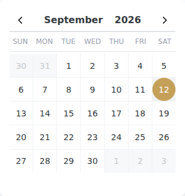
</p>

## Strengths

- 🏗️ **Headless & Modular**: Use the `useDates` hook for complete control over your UI, or the `Calendar` component for a beautiful, ready-to-use setup.
- 🪶 **Lightweight**: Small footprint with a pluggable adapter system (defaults to Day.js).
- 🛡️ **Type-safe**: Written in TypeScript for a great developer experience.
- 🎨 **Fully Customizable**: Style everything via Tailwind CSS or custom class names.
- 🌍 **Localized**: Easy internationalization support with `dayjs` or custom adapters.
- ⚡ **Feature-rich**: Single, multiple, and range selection modes, min/max dates, disabled dates, and more.

---

## API Reference

### Imports

```tsx
import {
  Calendar,
  useDates,
  Dates,
  Day,
  DayjsAdapter,
  defaultAdapter
} from 'react-modular-datepicker';
```

### `Calendar` Component

The primary component for a ready-to-use calendar.

| Prop | Type | Default | Description |
| :--- | :--- | :--- | :--- |
| `date` | `Date` | `new Date()` | The initial date/month to display. |
| `selected` | `Date \| Date[] \| Range` | `undefined` | The currently selected date(s). |
| `selectionMode` | `'single' \| 'range' \| 'multiple'` | `'single'` | The selection behavior. |
| `onChange` | `(selected: any) => void` | `undefined` | Callback triggered when the selection changes. |
| `minDate` | `Date` | `undefined` | The earliest selectable date. |
| `maxDate` | `Date` | `undefined` | The latest selectable date. |
| `disabledDates` | `Date[]` | `undefined` | An array of dates that should be disabled. |
| `monthsToDisplay` | `number` | `1` | Number of months to show simultaneously. |
| `firstDayOfWeek` | `number` | `0` | The first day of the week (0=Sun, 1=Mon, ...). |
| `showOutsideDays` | `boolean` | `false` | Whether to show days from the previous/next months. |
| `classNames` | `CalendarClassNames` | `undefined` | Custom classes for styling various parts of the UI. |
| `locale` | `string` | `undefined` | Locale for date formatting (e.g., 'fr', 'es'). |
| `translations` | `Partial<Translations>` | `undefined` | Custom translation strings for "Back" and "Forward". |
| `adapter` | `DateAdapter` | `defaultAdapter` | The date management adapter (e.g., DayjsAdapter). |

### `useDates` Hook

The logic core of the library. It handles selection, navigation, and grid generation.

```typescript
const {
  calendars,
  getDateProps,
  getBackProps,
  getForwardProps,
  setOffset
} = useDates(props: UseDatesProps);
```

**`UseDatesProps`** includes all props from `Calendar` (except `classNames`, `locale`, `translations`) plus:
- `onDateSelected`: `(dateObj: DateObj, event: any) => void`
- `onOffsetChanged`: `(newOffset: number) => void`
- `modifiers`: `Record<string, (date: Date) => boolean>`

### Main Types

#### `DateObj`
Represents a single day in the calendar grid.
- `date`: `Date`
- `selected`: `boolean`
- `selectable`: `boolean`
- `today`: `boolean`
- `prevMonth`/`nextMonth`: `boolean` (if outside current month)
- `isRangeStart`/`isRangeEnd`/`isRangeBetween`/`isRangeHovering`: `boolean`
- `modifiers`: `string[]`

#### `Calendar`
Represents a month grid.
- `month`: `number` (0-11)
- `year`: `number`
- `weeks`: `(DateObj | null)[][]`

---

## Recipes

<details>
<summary><b>Basic Selection</b></summary>
A simple single-date selection calendar.

```tsx
import { Calendar } from 'react-modular-datepicker';
import 'react-modular-datepicker/dist/index.css';

function BasicExample() {
  return <Calendar onChange={(date) => console.log(date)} />;
}
```

<br />

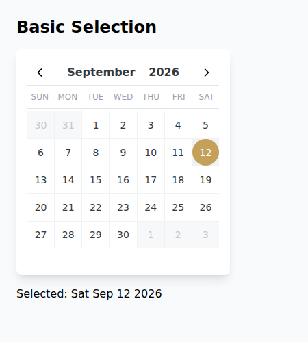

</details>

<details>
<summary><b>Range Selection</b></summary>
Select a start and end date with a hover preview.

```tsx
<Calendar
  selectionMode="range"
  monthsToDisplay={2}
  onChange={(range) => console.log(range)}
/>
```

<br />

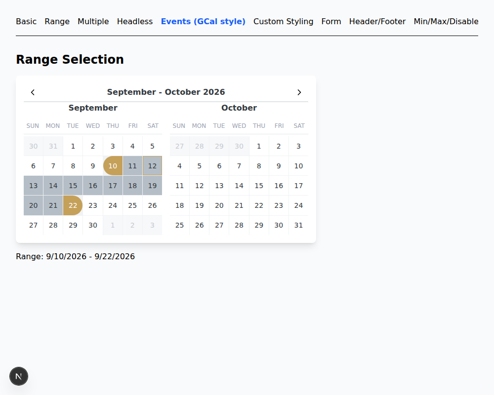

</details>

<details>
<summary><b>Multiple Selection</b></summary>
Select as many dates as you want.

```tsx
<Calendar
  selectionMode="multiple"
  onChange={(dates) => console.log(dates)}
/>
```

<br />

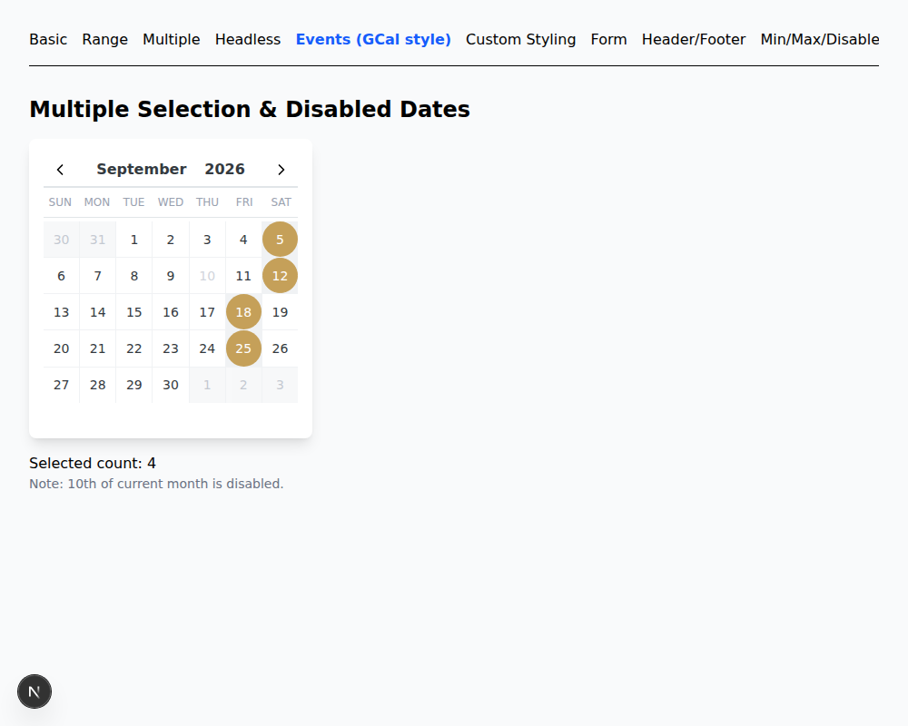

</details>

<details>
<summary><b>Headless Usage</b></summary>
Complete freedom over your UI using the `useDates` hook.

```tsx
const { calendars, getDateProps } = useDates({ selectionMode: 'single' });

return (
  <div className="grid grid-cols-7">
    {calendars[0].weeks.flat().map((dateObj, i) => (
      dateObj ? (
        <button key={i} {...getDateProps({ dateObj })}>
          {dateObj.date.getDate()}
        </button>
      ) : <div key={i} />
    ))}
  </div>
);
```

<br />

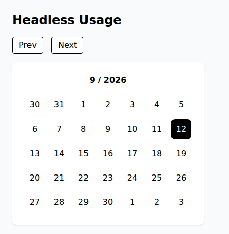

</details>

<details>
<summary><b>Custom Styling</b></summary>
Easily customize the look and feel using the `classNames` prop.

```tsx
<Calendar
  classNames={{
    root: 'bg-indigo-900 text-white',
    day: {
      selected: 'bg-pink-500 text-white',
      today: 'border-pink-500 text-pink-500',
    }
  }}
/>
```

<br />

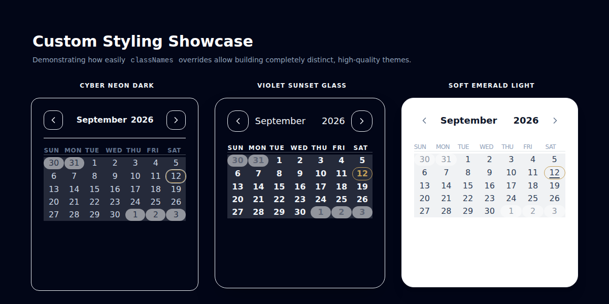

</details>

<details>
<summary><b>Form Integration</b></summary>
Integrate the calendar into a form or popup.

```tsx
const [date, setDate] = useState<Date | null>(null);

<div className="relative group">
  <input
    type="text"
    readOnly
    value={date ? date.toLocaleDateString() : ''}
    placeholder="Pick a date"
  />
  <div className="absolute top-full left-0 mt-2 z-50 invisible group-focus-within:visible">
    <Calendar
      selected={date}
      onChange={(d) => setDate(d as Date)}
    />
  </div>
</div>
```

<br />

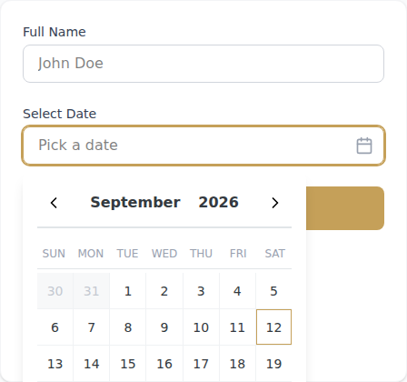

</details>

<details>
<summary><b>Custom Header & Footer</b></summary>
Customize header, footer, and day tooltips.

```tsx
<Calendar
  selected={selected}
  onChange={(val) => setSelected(val as Date)}
  monthsToDisplay={2}
  header={<div className="p-2 bg-blue-100 text-blue-800 font-bold text-center rounded-t-lg">My Header</div>}
  footer={<div className="p-2 bg-gray-100 text-gray-600 text-sm text-center rounded-b-lg border-t">My Custom Footer</div>}
  renderDayTooltip={(dateObj) => (
    dateObj.date.getDate() === 15 ? 'Middle of the month!' : null
  )}
/>
```

<br />

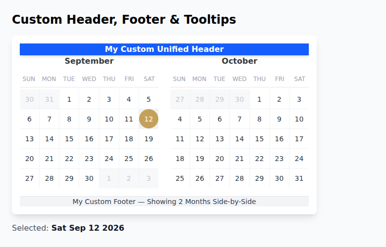

</details>

<details>
<summary><b>Min, Max & Disabled Dates</b></summary>
Restrict date selection with min/max bounds or specific disabled dates.

```tsx
<Calendar
  selected={selected}
  onChange={(val) => setSelected(val as Date)}
  minDate={minDate}
  maxDate={maxDate}
  disabledDates={[disabledDate1, disabledDate2]}
/>
```

<br />

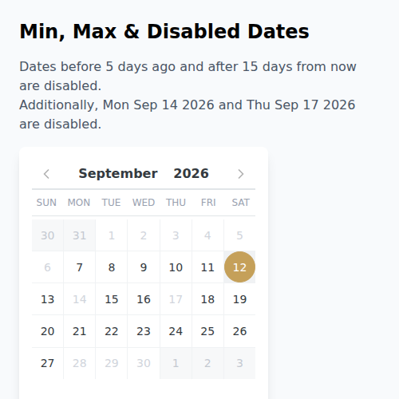

</details>

<details>
<summary><b>Yearly View</b></summary>
Display an entire year at once by customizing the grid and `monthsToDisplay`.

```tsx
<Calendar
  selected={selected}
  onChange={(val) => setSelected(val as Date)}
  monthsToDisplay={12}
  classNames={{
    calendarsContainer: "grid grid-cols-1 md:grid-cols-2 lg:grid-cols-3 gap-6"
  }}
/>
```

<br />

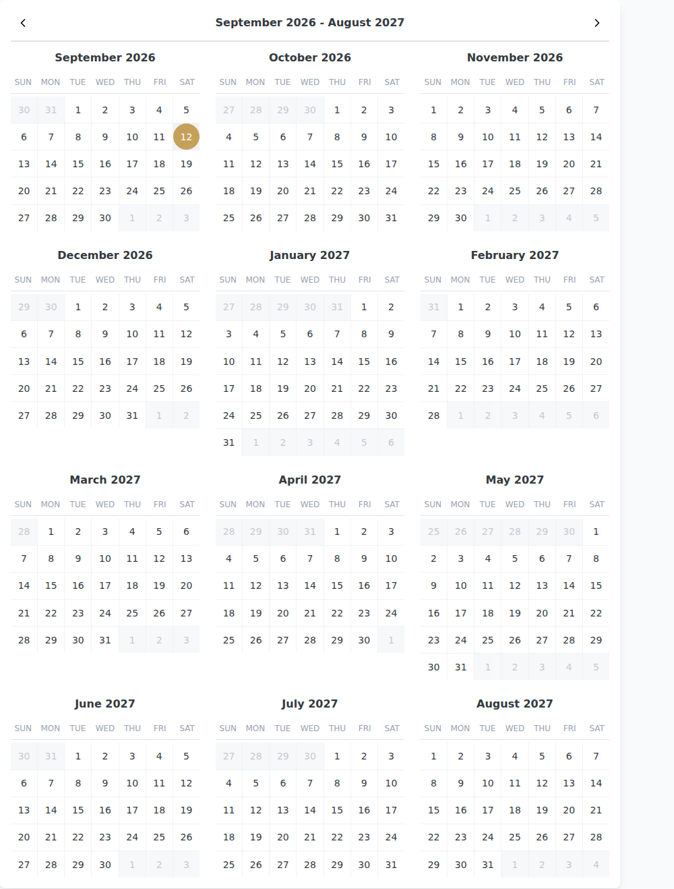

</details>

<details>
<summary><b>Availability & Async Data</b></summary>
Fetch and display availability dynamically when the month changes.

```tsx
<Calendar
  selected={selected}
  onChange={(val) => setSelected(val as Date)}
  onMonthChange={(date) => fetchAvailabilities(date)}
  modifiers={{
    available: (date) => availabilities[date.toDateString()] === true,
    unavailable: (date) => availabilities[date.toDateString()] === false,
  }}
  disabledDates={
    Object.keys(availabilities)
      .filter(key => !availabilities[key])
      .map(key => new Date(key))
  }
  classNames={{
    day: {
      available: "bg-green-100 text-green-800 hover:bg-green-200",
      unavailable: "bg-red-50 text-red-300 line-through cursor-not-allowed",
    }
  }}
/>
```

<br />

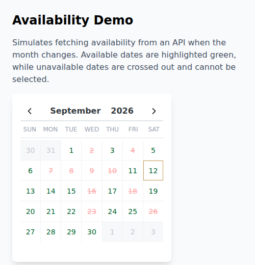

</details>

<details>
<summary><b>Full-Featured / Events Calendar (Google Calendar style)</b></summary>
Build a full-page events calendar using the `useDates` hook.

```tsx
const { calendars, getBackProps, getForwardProps, getDateProps } = useDates({
  showOutsideDays: true,
  selected: selectedDate,
  onChange: (d) => setSelectedDate(d as Date),
});

// Render custom full-grid layout with event badges...
```

<br />

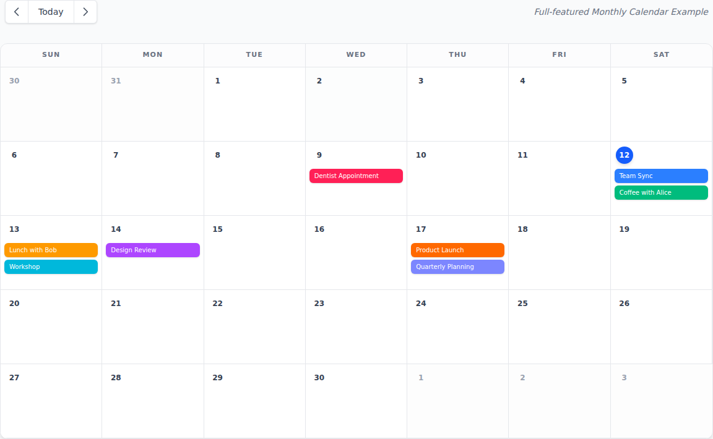

</details>

---

## Contributors

We welcome contributions! Here’s how you can get started:

### Installation

1. Clone the repository.
2. Install dependencies:
   ```bash
   pnpm install
   ```

### Development

Start the development server with the example app:
```bash
pnpm run dev
```
This runs `vite` in watch mode for the library and starts the Next.js example app at `http://localhost:3000`.

### Testing

Run end-to-end tests using Playwright:
```bash
pnpm run test:e2e
```

### Documentation & Examples

- To update documentation, edit the `README.md`.
- To add or modify examples, check the `examples/` directory.

### Building

Build the package for production:
```bash
pnpm run build
```

---

License: MIT
